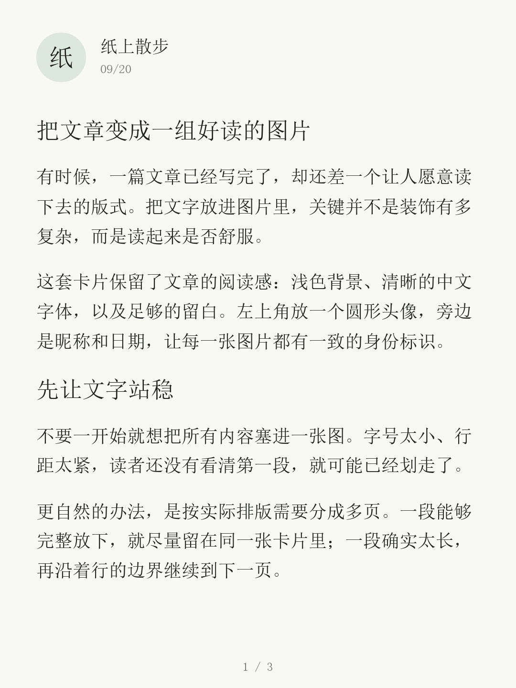
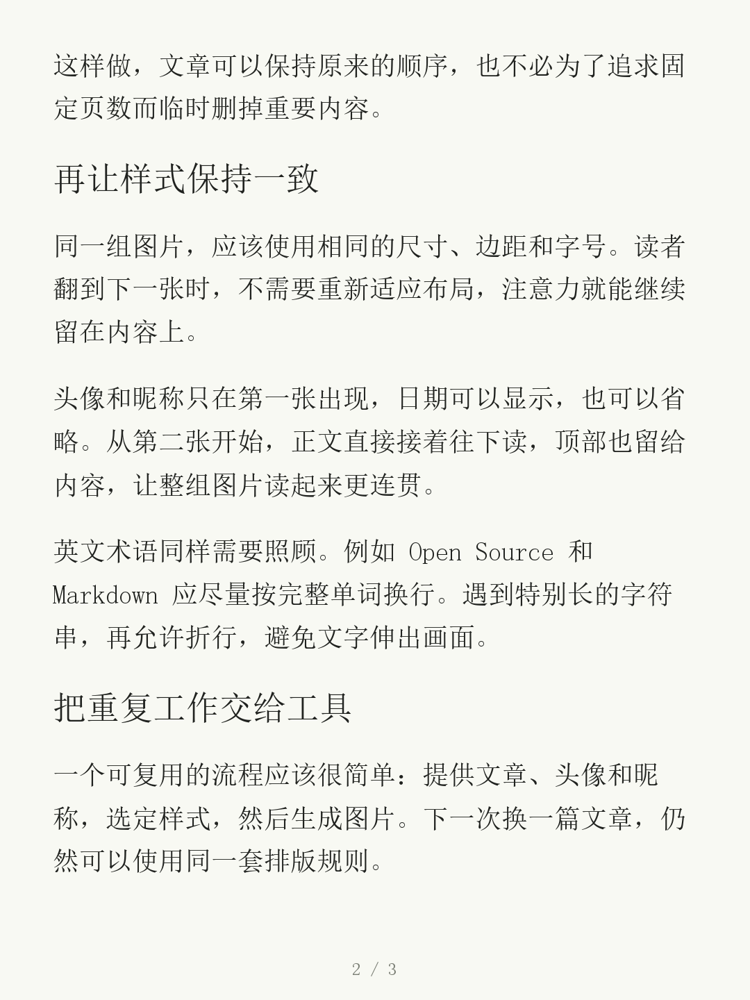
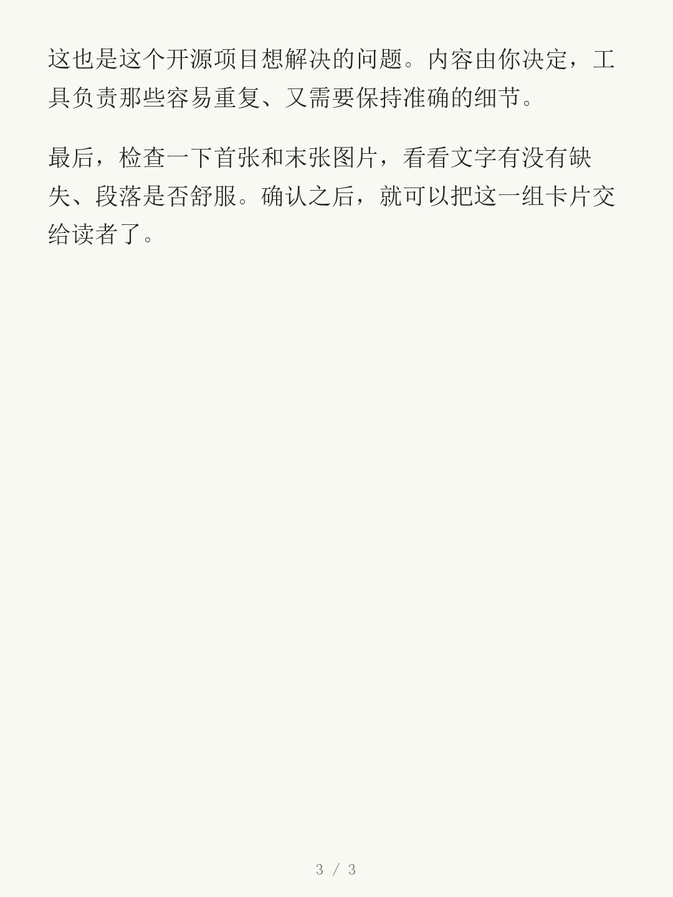
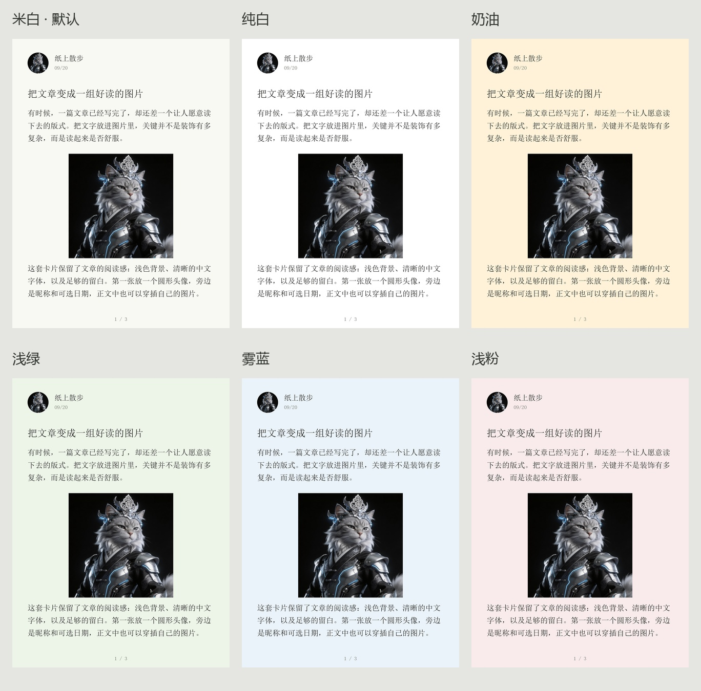

<div align="center">

# 文章转小红书

### 文章写好了，别卡在排版上。

把一篇长文，变成一组带头像、有留白、翻页也好读的图文卡片。<br>
保留你的文字，让排版自动完成。<br>
<strong>统一宋体阅读排版 · 六种背景可选 · 默认米白</strong>

<p>
  <a href="https://github.com/Fangx-AI/article-to-xiaohongshu/actions/workflows/test.yml"></a>
  <a href="LICENSE"></a>
  
  
</p>

[看效果](#先看成品) · [选择背景](#让每一篇都带着你的风格) · [开始使用](#跑出你的第一组图) · [安装 Skill](#让-ai-帮你完成这件事)

<sub>Turn articles into Xiaohongshu carousel cards. A local renderer and an Agent Skill.</sub>

</div>

<br>

## 先看成品

**一篇文章 → 三张卡片。** 以下是工具实际生成的图片，点击可查看原图。

<p align="center">
  <a href="examples/preview.png"></a>
  <a href="examples/page-02.png"></a>
  <a href="examples/page-03.png"></a>
</p>

<p align="center"><sub>1080 × 1440 · 3:4 竖版 · 米白底 · 宋体正文 · 仅首张显示作者信息</sub></p>

示例使用昵称首字作为头像。换成你的头像文件，就能使用同样的圆形头像排版。[查看示例原文 →](examples/article.md)

**这就是项目的默认版式。** 宋体正文、宽松行距、自然分页。首张显示圆形头像、昵称和可选日期，第二张起直接接正文，利用顶部空间连续阅读。六种背景沿用同一套字体、字号、留白和布局，选择配色即可使用。

## 从「写完了」到「可以发了」

文章有了，观点也讲清楚了，接下来却要反复复制文字、调整字号、拆成几页，再把头像和昵称摆到相同的位置。

**这个项目把这一步做成了可以重复使用的流程。** 提供文章、头像和昵称，生成整组图片；下一篇换内容，继续用你的版式。

| 你关心的事 | 它怎么处理 |
| --- | --- |
| 文字多了，一张放不下 | 按实际字体宽度换行、按可用高度分页，长文自动变成多张 |
| 不想为了凑页数删掉内容 | 默认保留原文，不擅自改写，不靠不断缩小字号挤进一页 |
| 翻到下一张，阅读不要被打断 | 统一尺寸和字体，仅首张显示头像、昵称及可选日期，后续页面直接接正文 |
| 想让图片有自己的辨识度 | 换上自己的头像和昵称，从米白、纯白、奶油、浅绿、雾蓝、浅粉中选择背景 |
| 希望生成后方便整理 | 同时输出按顺序编号的 PNG、整组预览和图片 ZIP |
| 不想再申请一个 API Key | 排版在本地运行，不调用图片生成 API，不上传文章或头像 |

适合把**观点长文、知识分享、读书笔记、教程说明**整理成连续阅读的卡片。当前主打文字阅读版式。

## 跑出你的第一组图

需要 **Python 3.10+** 和一款中文字体。Windows / macOS 会尝试寻找系统宋体；Linux 字体设置见下方 FAQ。

**① 下载项目，安装依赖**

```bash
git clone https://github.com/Fangx-AI/article-to-xiaohongshu.git
cd article-to-xiaohongshu
python -m pip install -r skills/article-to-xiaohongshu/requirements.txt
```

**② 先用自带文章跑一次**

```bash
python skills/article-to-xiaohongshu/scripts/render.py --article examples/article.md --name "纸上散步" --date "09/20" --output demo-output
```

打开 `demo-output`：`01.png` 开始就是正文图片，`contact-sheet.jpg` 可以一次看完整组，`cards.zip` 已帮你打包好。

**③ 换成你的文章和头像**

把 `article.md` 和 `avatar.jpg` 放进项目目录，修改昵称，再执行：

```bash
python skills/article-to-xiaohongshu/scripts/render.py --article article.md --avatar avatar.jpg --name "你的昵称" --output my-first-post
```

不传 `--date` 就不显示日期；不传 `--avatar` 就用昵称首字占位。每次生成请使用**新的或空的输出目录**。

## 让 AI 帮你完成这件事

这个项目也提供一个独立的 **Agent Skill**。安装后，可以直接把文章和要求交给支持 `SKILL.md` 的 AI 工具。

> 使用 article-to-xiaohongshu，把这篇文章做成小红书图文。<br>
> 头像用 avatar.jpg，昵称「纸上散步」。<br>
> 3:4 竖版，保留原文，不显示日期。完成后给我图片和压缩包。

未指定配色时使用米白；想换背景，只需补一句「背景用浅绿，保持默认字体和排版」。

将 [`skills/article-to-xiaohongshu`](skills/article-to-xiaohongshu) 整个文件夹放入对应工具的技能目录：

| 工具 | 目标目录 |
| --- | --- |
| Codex | `~/.codex/skills/article-to-xiaohongshu` |
| Claude Code | `~/.claude/skills/article-to-xiaohongshu` |
| 其他支持 Skill 的工具 | 按工具自身的技能目录配置 |

<details>
<summary><strong>展开：Codex 安装命令</strong></summary>

在本仓库根目录执行。若目标位置已有同名 Skill，请先检查再更新。

**macOS / Linux**

```bash
mkdir -p ~/.codex/skills
cp -R skills/article-to-xiaohongshu ~/.codex/skills/
python -m pip install -r ~/.codex/skills/article-to-xiaohongshu/requirements.txt
```

**Windows PowerShell**

```powershell
New-Item -ItemType Directory -Force "$env:USERPROFILE/.codex/skills" | Out-Null
Copy-Item -Recurse "skills/article-to-xiaohongshu" "$env:USERPROFILE/.codex/skills/"
python -m pip install -r "$env:USERPROFILE/.codex/skills/article-to-xiaohongshu/requirements.txt"
```

依赖应安装到 Agent 实际使用的 Python 环境中；自定义了技能目录时，请相应调整路径。

</details>

## 让每一篇都带着你的风格

**同一种阅读排版，六种背景颜色。** 保留宋体、字号、留白、头像位置和分页方式，通过背景选择你喜欢的氛围。



| 米白（默认） | 纯白 | 奶油 | 浅绿 | 雾蓝 | 浅粉 |
| --- | --- | --- | --- | --- | --- |
| `paper` | `white` | `cream` | `sage` | `mist` | `rose` |

例如，生成雾蓝背景：

```bash
python skills/article-to-xiaohongshu/scripts/render.py --article examples/article.md --name "纸上散步" --theme mist --output mist-output
```

使用 Skill 时，也可以直接说「用雾蓝背景，保持原来的宋体和排版」。

需要进一步调整时，可以保存一份 JSON 配置。**配置中显式填写的字段优先于主题**；要让 `--theme` 决定背景，请不要在 JSON 中填写 `background`。

```json
{
  "width": 1080,
  "height": 1440,
  "font_size": 38,
  "line_height": 62,
  "background": "#F8F9F3",
  "foreground": "#20221F"
}
```

仓库已提供 [`examples/style.json`](examples/style.json)，在生成时加上 `--config` 即可：

```bash
python skills/article-to-xiaohongshu/scripts/render.py --article article.md --name "你的昵称" --config examples/style.json --output styled-output
```

[查看全部配置项：尺寸、留白、头像、字号、行距与颜色 →](skills/article-to-xiaohongshu/references/config.md)

## 使用前，你可能想知道

<details>
<summary><strong>文章会被改写吗？Markdown 支持到什么程度？</strong></summary>

渲染器不改写文章。输入支持 UTF-8 的 `.txt` 和轻量 Markdown：空行分段，`#`、`##`、`###` 作为标题，段内单个换行合并为空格。其他 Markdown 语法按普通文字显示。

当前不渲染加粗、表格、代码块或正文插图。复杂文档请先整理成适合卡片阅读的文本。AI 是否先改写文章，由你的提示词决定。

</details>

<details>
<summary><strong>需要付费 API、联网或者登录小红书吗？</strong></summary>

图片生成不需要。安装好 Python 依赖和字体后，渲染器可以离线运行，文章与头像留在本地。生成完成后，由你检查并上传图片。

如果通过云端 AI Agent 使用 Skill，提供给该 Agent 的素材仍按它自身的数据处理方式处理；本项目的渲染脚本不会额外上传。

</details>

<details>
<summary><strong>找不到中文字体，或者提示缺字怎么办？</strong></summary>

Ubuntu / Debian 可以安装 Noto CJK：

```bash
sudo apt-get install fonts-noto-cjk
```

也可以指定本地字体文件：

```bash
python skills/article-to-xiaohongshu/scripts/render.py --article article.md --name "作者" --font /path/to/font.ttc --font-index 0 --output custom-font-output
```

字体缺字时脚本会报错，请换用覆盖所需文字的字体。当前不支持多字体回退和彩色 emoji。仓库不捆绑系统字体，使用或再分发字体时请遵循其许可证。

</details>

<details>
<summary><strong>长文章会生成多少页？能指定页数吗？</strong></summary>

页数由内容长度、字体和可用版面共同决定，当前不提供固定页数参数。段落尽量完整保留，超长段落才按行跨页。可以调整样式，或先自行精简文章。

工具不绑定平台上传数量限制。特别长的文章，请根据发布时的实际限制分组。

</details>

<details>
<summary><strong>除了图片，还会得到什么？</strong></summary>

```text
my-first-post/
├── 01.png               第一张卡片
├── 02.png               后续卡片，按顺序编号
├── …
├── contact-sheet.jpg    整组缩略预览
├── cards.zip            仅含正文 PNG 的压缩包
└── manifest.json        源文件哈希、样式、分页文字及行框
```

重新生成时使用新的或空的目录，避免混入上一版图片。发布前建议查看整组预览，再放大检查首张、末张和跨页段落。

</details>

## 小工具，也认真对待每一行字

仓库包含 [自动化测试](tests/test_render.py)，并通过 GitHub Actions 在 **Windows、macOS、Linux** 上执行。验证内容包括文字完整性、行框边界、中文标点、超长英文、不同画幅和错误输入。

```bash
python -m unittest discover -s tests -v
```

发现排版问题？欢迎[提交 Issue](https://github.com/Fangx-AI/article-to-xiaohongshu/issues)，附上一小段可复现的脱敏文字、字体和配置。也欢迎用 Pull Request 改进排版或补充测试。

**[MIT 开源](LICENSE)** · 可修改、复用和用于商业项目，请保留许可证声明。文章、头像及字体的使用权需自行确认。本项目与小红书官方无关联。

---

<div align="center">

**把时间留给写作，把重复的排版交给工具。**

[开始生成第一组图 ↑](#跑出你的第一组图)

</div>
