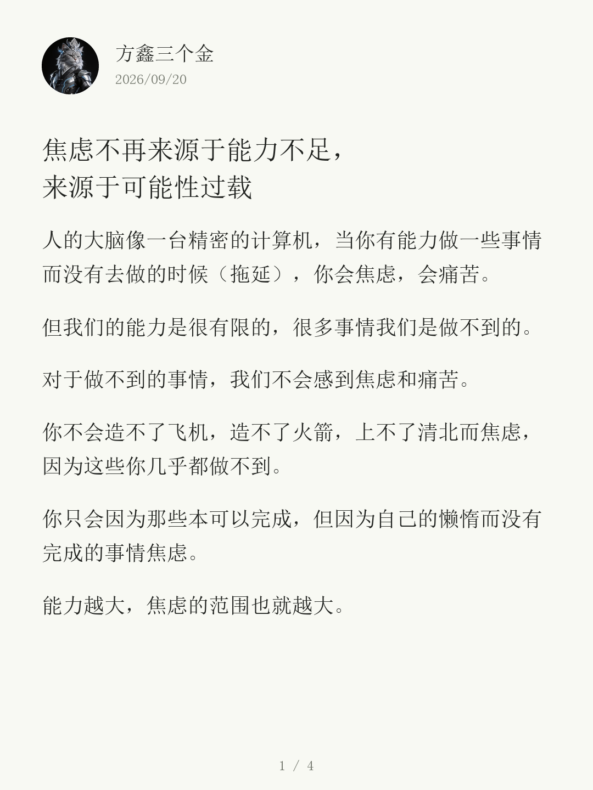
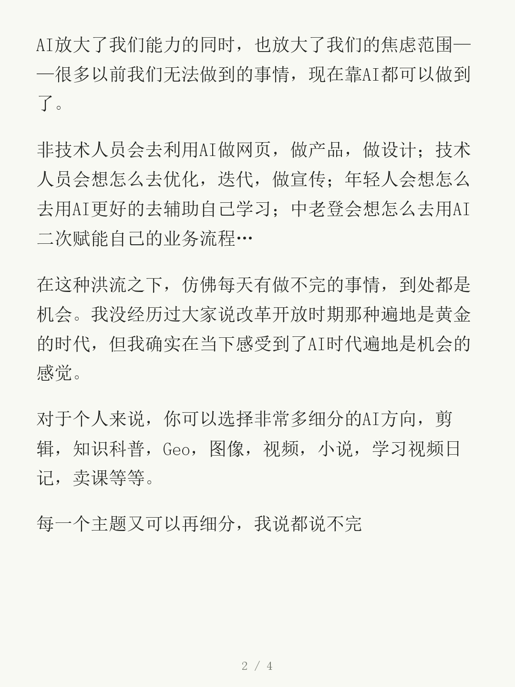
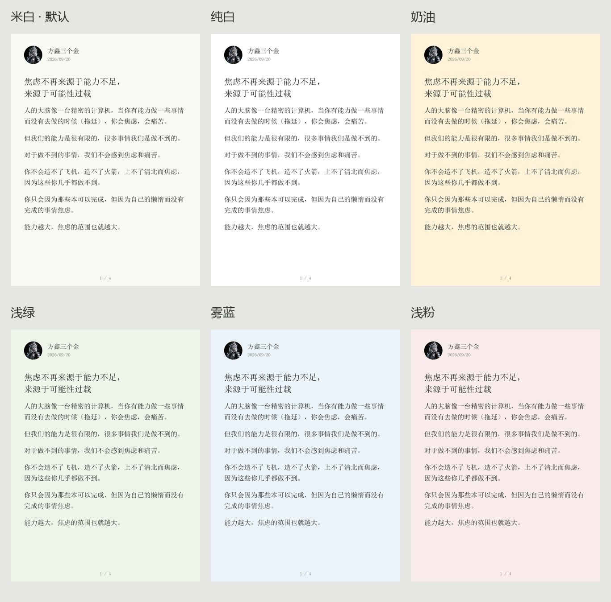

<div align="center">

# 文卡 · Wenka

### 文章写好了，别卡在排版上。

把一篇长文，变成一组带头像、有留白、翻页也好读的图文卡片。<br>
保留你的文字，让排版自动完成。<br>
<strong>统一宋体阅读排版 · 六种背景可选 · 默认米白</strong>

<p>
  <a href="https://github.com/Fangx-AI/wenka/actions/workflows/test.yml"></a>
  <a href="LICENSE"></a>
  
  
</p>

[看效果](#先看成品) · [选择背景](#风格选择) · [让 AI 安装](#如何安装) · [开始使用](#如何使用)

<sub>Turn articles into Xiaohongshu carousel cards. A local renderer and an Agent Skill.</sub>

</div>

<br>

## 先看成品

**一篇文章 → 一组卡片。** 以下展示前三张，点击可查看原图。[查看完整四张 →](examples/showcase-article-v1/contact-sheet.jpg)

<p align="center">
  <a href="examples/showcase-article-v1/01.png"></a>
  <a href="examples/showcase-article-v1/02.png"></a>
  <a href="examples/showcase-article-v1/03.png"></a>
</p>

<p align="center"><sub>1080 × 1440 · 3:4 竖版 · 米白底 · 宋体正文 · 仅首张显示作者信息</sub></p>

示例：《焦虑不再来源于能力不足，来源于可能性过载》。昵称「方鑫三个金」，使用作者提供的头像；文字保留原文，正文配图由 AI 生成。[查看原文 →](examples/original-article.md)

**这就是项目的默认版式。** 宋体正文、宽松行距、自然分页。首张显示圆形头像、昵称和可选日期，第二张起直接接正文，利用顶部空间连续阅读。六种背景沿用同一套字体、字号、留白和布局，选择配色即可使用。

| 你关心的事 | 它怎么处理 |
| --- | --- |
| 文字多了，一张放不下 | 按实际字体宽度换行、按可用高度分页，长文自动变成多张 |
| 不想为了凑页数删掉内容 | 默认保留原文，不擅自改写，不靠不断缩小字号挤进一页 |
| 翻到下一张，阅读不要被打断 | 统一尺寸和字体，仅首张显示头像、昵称及可选日期，后续页面直接接正文 |
| 想让图片有自己的辨识度 | 换上自己的头像和昵称，从米白、纯白、奶油、浅绿、雾蓝、浅粉中选择背景 |
| 希望生成后方便整理 | 同时输出按顺序编号的 PNG、整组预览和图片 ZIP |
| 不想再申请一个 API Key | 排版在本地运行，不调用图片生成 API，不上传文章或头像 |

适合把**观点长文、知识分享、读书笔记、教程说明**整理成连续阅读的卡片。当前主打文字阅读版式。

## 如何安装

把下面这段话直接发给 **Codex、Claude Code、豆包、Workbuddy 等**：

```text
帮我安装这个 Skill：
https://github.com/Fangx-AI/wenka
```

## 如何使用

发给 AI 一篇文章，说一句：

```text
用 wenka 把这篇文章做成小红书图文。
```

## 风格选择

**同一种阅读排版，六种背景颜色。** 保留宋体、字号、留白、头像位置和分页方式，通过背景选择你喜欢的氛围。



| 米白（默认） | 纯白 | 奶油 | 浅绿 | 雾蓝 | 浅粉 |
| --- | --- | --- | --- | --- | --- |
| `paper` | `white` | `cream` | `sage` | `mist` | `rose` |

直接告诉 Agent：

> 这次用雾蓝背景，保持原来的宋体和排版。

<details>
<summary><strong>展开：命令行配色与高级参数</strong></summary>

```bash
python skills/wenka/scripts/render.py --article examples/article.md --name "方鑫三个金" --theme mist --output mist-output
```

需要进一步调整时，可以保存一份 JSON 配置。**配置中显式填写的字段优先于主题**；要让 `--theme` 决定背景，请不要在 JSON 中填写 `background`。

```json
{
  "width": 1080,
  "height": 1440,
  "font_size": 38,
  "line_height": 62,
  "background": "#F8F9F3",
  "foreground": "#20221F"
}
```

仓库已提供 [`examples/style.json`](examples/style.json)，在生成时加上 `--config` 即可：

```bash
python skills/wenka/scripts/render.py --article article.md --name "你的昵称" --config examples/style.json --output styled-output
```

[查看全部配置项：尺寸、留白、头像、字号、行距与颜色 →](skills/wenka/references/config.md)

</details>

## 使用前，你可能想知道

<details>
<summary><strong>文章会被改写吗？Markdown 支持到什么程度？</strong></summary>

渲染器不改写文章。输入支持 UTF-8 的 `.txt` 和轻量 Markdown：空行分段，`#`、`##`、`###` 作为标题，段内单个换行合并为空格。其他 Markdown 语法按普通文字显示。

正文支持独占一行的本地图片：``。图片路径相对于文章所在目录，图片按比例居中显示，放不下时整张移到下一页；不会裁切或拆开。图片说明用于记录，不显示为图注。

当前不渲染加粗、表格或代码块，不自动下载网络图片。复杂文档请先整理成适合卡片阅读的文本。AI 是否先改写文章，由你的提示词决定。

</details>

<details>
<summary><strong>需要付费 API、联网或者登录小红书吗？</strong></summary>

图片生成不需要。安装好 Python 依赖和字体后，渲染器可以离线运行，文章与头像留在本地。生成完成后，由你检查并上传图片。

如果通过云端 AI Agent 使用 Skill，提供给该 Agent 的素材仍按它自身的数据处理方式处理；本项目的渲染脚本不会额外上传。

</details>

<details>
<summary><strong>找不到中文字体，或者提示缺字怎么办？</strong></summary>

Ubuntu / Debian 可以安装 Noto CJK：

```bash
sudo apt-get install fonts-noto-cjk
```

也可以指定本地字体文件：

```bash
python skills/wenka/scripts/render.py --article article.md --name "作者" --font /path/to/font.ttc --font-index 0 --output custom-font-output
```

字体缺字时脚本会报错，请换用覆盖所需文字的字体。当前不支持多字体回退和彩色 emoji。仓库不捆绑系统字体，使用或再分发字体时请遵循其许可证。

</details>

<details>
<summary><strong>长文章会生成多少页？能指定页数吗？</strong></summary>

页数由内容长度、字体和可用版面共同决定，当前不提供固定页数参数。段落尽量完整保留，超长段落才按行跨页。可以调整样式，或先自行精简文章。

工具不绑定平台上传数量限制。特别长的文章，请根据发布时的实际限制分组。

</details>

<details>
<summary><strong>除了图片，还会得到什么？</strong></summary>

```text
my-first-post/
├── 01.png               第一张卡片
├── 02.png               后续卡片，按顺序编号
├── …
├── contact-sheet.jpg    整组缩略预览
├── cards.zip            仅含正文 PNG 的压缩包
└── manifest.json        源文件哈希、样式、分页文字及行框
```

重新生成时使用新的或空的目录，避免混入上一版图片。发布前建议查看整组预览，再放大检查首张、末张和跨页段落。

</details>

## 小工具，也认真对待每一行字

仓库包含 [自动化测试](tests/test_render.py)，并通过 GitHub Actions 在 **Windows、macOS、Linux** 上执行。验证内容包括文字完整性、行框边界、中文标点、超长英文、不同画幅和错误输入。

```bash
python -m unittest discover -s tests -v
```

发现排版问题？欢迎[提交 Issue](https://github.com/Fangx-AI/wenka/issues)，附上一小段可复现的脱敏文字、字体和配置。也欢迎用 Pull Request 改进排版或补充测试。

**[MIT 开源](LICENSE)** · 可修改、复用和用于商业项目，请保留许可证声明。文章、头像及字体的使用权需自行确认。本项目与小红书官方无关联。

---

<div align="center">

**把时间留给写作，把重复的排版交给工具。**

[让 AI 帮你安装 ↑](#如何安装)

</div>
