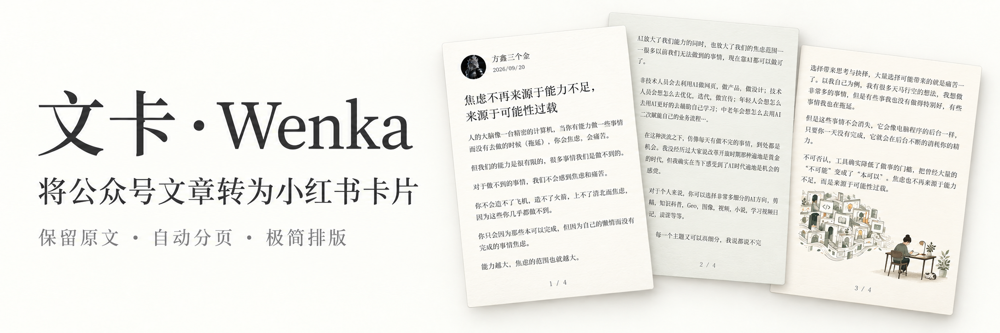

<div align="center">



<p>
  <a href="https://github.com/Fangx-AI/wenka/actions/workflows/test.yml"></a>
  <a href="LICENSE"></a>
  
  
</p>

[看效果](#先看成品) · [选择背景](#风格选择) · [让 AI 安装](#如何安装) · [开始使用](#如何使用)

<sub>Turn WeChat Official Account articles into Xiaohongshu carousel cards. A local renderer and an Agent Skill.</sub>

</div>

<br>

## 先看成品

**一篇公众号文章 → 一组小红书卡片。**

<p align="center">
  <a href="examples/showcase-article-v1/01.png"></a>
  <a href="examples/showcase-article-v1/02.png"></a>
  <a href="examples/showcase-article-v1/03.png"></a>
</p>

<p align="center"><sub>1080 × 1440 · 3:4 竖版 · 米白底 · 宋体正文 · 仅首张显示作者信息</sub></p>

<table width="100%">
  <thead>
    <tr><th width="180" align="left">功能</th><th width="820" align="left">效果</th></tr>
  </thead>
  <tbody>
    <tr><td>自动分页</td><td>长文自动排成多张卡片</td></tr>
    <tr><td>保留原文</td><td>不删减，不改写</td></tr>
    <tr><td>连贯阅读</td><td>统一排版，仅首张显示作者信息</td></tr>
    <tr><td>个性样式</td><td>自定义头像、昵称，六种背景可选</td></tr>
    <tr><td>整组导出</td><td>高清 PNG、预览图、ZIP 压缩包</td></tr>
    <tr><td>本地生成</td><td>无需 API Key，渲染器不上传内容</td></tr>
  </tbody>
</table>

适合将公众号里的**观点长文、知识分享、读书笔记、教程说明**同步为小红书卡片。

## 如何安装

把下面这段话直接发给 **Codex、Claude Code、豆包、Workbuddy 等**：

```text
帮我安装这个 Skill：
https://github.com/Fangx-AI/wenka
```

## 如何使用

发给 AI：

```text
用 wenka 把这篇【公众号链接 或 文章内容】转成小红书卡片。
```

## 风格选择

**六种背景，同一套宋体排版。**


| 米白（默认） | 纯白 | 奶油 | 浅绿 | 雾蓝 | 浅粉 |
| --- | --- | --- | --- | --- | --- |
| `paper` | `white` | `cream` | `sage` | `mist` | `rose` |

换色只需说：

> 这次用雾蓝背景。

<details>
<summary><strong>高级设置</strong></summary>

`--theme` 换背景，`--config` 调整尺寸、字体和留白。配置文件中的值优先。

[参数说明](skills/wenka/references/config.md) · [配置示例](examples/style.json)

</details>

## 常见问题

<details>
<summary><strong>会改写原文吗？</strong></summary>

默认不删减、不改写。需要精简时，明确告诉 Agent。

</details>

<details>
<summary><strong>支持哪些内容？</strong></summary>

支持纯文本、Markdown 标题、段落和本地图片；不渲染加粗、表格或代码块。公众号链接由 Agent 读取，无法读取时粘贴正文即可。

</details>

<details>
<summary><strong>需要 API Key 吗？</strong></summary>

不需要。环境装好后可离线排版，无需登录小红书。渲染器不上传内容；云端 Agent 按其自身规则处理素材。

</details>

<details>
<summary><strong>中文缺字怎么办？</strong></summary>

让 Agent 安装宋体或 Noto Serif CJK，也可用 `--font` 指定字体。[安装指南](INSTALL.md)

</details>

<details>
<summary><strong>能指定页数吗？</strong></summary>

不能。根据文章长度自动分页，不靠缩小字号挤内容。

</details>

<details>
<summary><strong>生成哪些文件？</strong></summary>

编号 PNG、整组预览、ZIP 压缩包和排版记录。每次使用新的或空的输出目录。

</details>

## 开源与反馈

[跨平台测试](https://github.com/Fangx-AI/wenka/actions/workflows/test.yml) · [提交问题](https://github.com/Fangx-AI/wenka/issues) · [MIT 许可](LICENSE)

支持 Windows、macOS、Linux。可修改、商用，需保留许可证；文章、图片和字体需有使用权。
